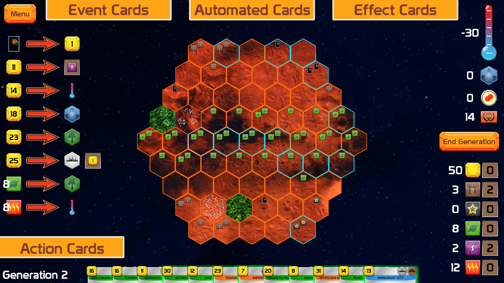
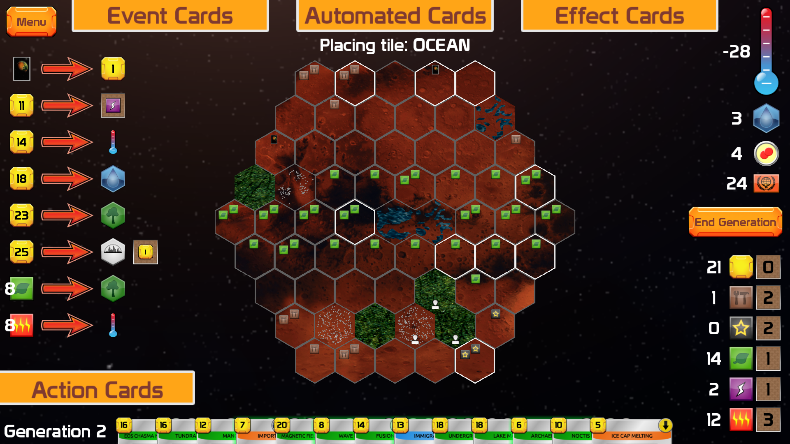
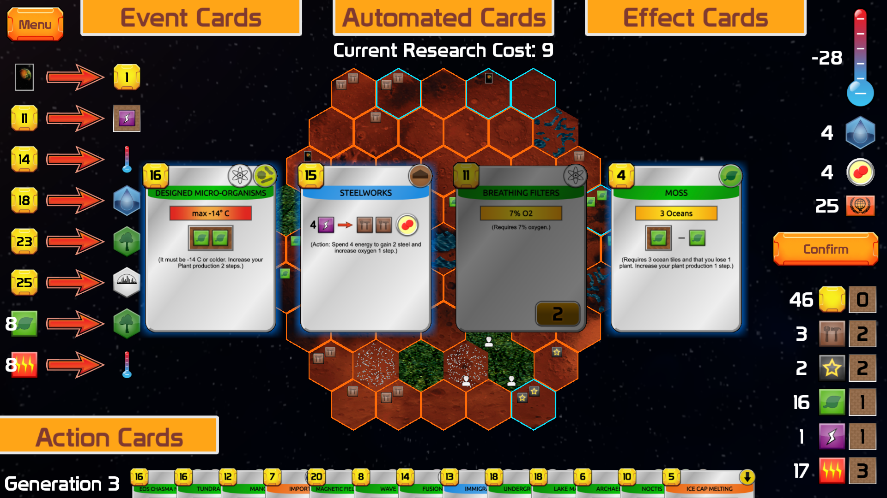
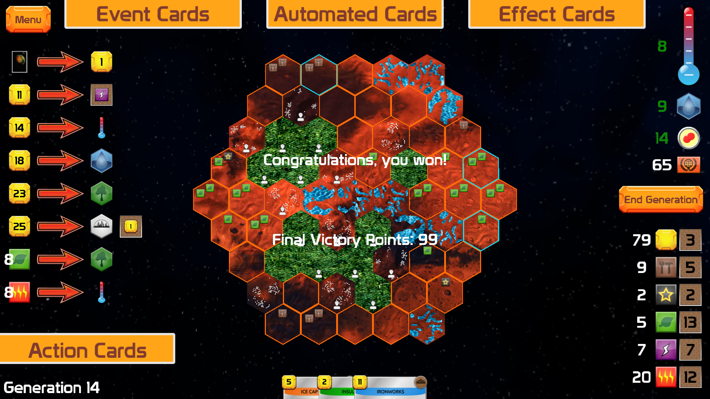

# Terraforming Mars in OpenGL

The paper for this project is available in the [BSc thesis repository](https://github.com/Nub3rt/thesis).

This repository contains the implementation for my BSc thesis, **Terraforming Mars in OpenGL**. The project is a 3D implementation of the board game written in C++ and OpenGL, with the game logic separated from the rendering layer.

## Highlights

- **Custom animation system** – an animation framework implemented from scratch, including easing, animation queues, lockouts, callbacks, and support for animating vectors such as positions, colors, and scales.
- **Model/View separation** – platform-independent game logic is kept in the Model, while OpenGL rendering and input handling are implemented in the View.
- **Extensible game architecture** – boards, decks, cards, and game variants are structured so that new implementations can be added without changing the core architecture.
- **Custom OpenGL interaction and rendering** – includes stencil-buffer mouse picking, shader-based card highlights, 3D board rendering, text rendering, and a 2D HUD.

## Pictures

## Technologies and Dependencies

The project uses C++20 with OpenGL and the following main libraries:

- SDL3
- GLEW
- GLM
- Dear ImGui
- FreeType

Dependencies are managed with vcpkg.

For the complete development environment, dependency versions, installation command, and required assets, see **§1.1 Utilized libraries** and **§1.2 Assets** of *Section II* of the [thesis](https://github.com/Nub3rt/thesis).

## Building

The project was developed with Visual Studio 2022 on Windows 11. The application requires several preprocessor definitions and is intended to be built in the x64/Release configuration.

For the exact compilation requirements and runtime directory structure, see **§1.3 Compilation** and **§1.4 Runtime environment** of *Section II* of the [thesis](https://github.com/Nub3rt/thesis).

## Architecture

The implementation is divided into a platform-independent **Model** and an OpenGL-based **View**. The Model contains the game rules and state, while the View is responsible for rendering, input, and presentation.

The thesis contains the detailed architecture and implementation documentation in **§2 Architecture** and **§3 View**.

## Implementation Details

Some of the more involved implementation details are documented in the thesis, including:

- board and card architecture in **§2.1 Model** and **§2.2 Decks and cards**
- the custom animation framework in **§3.2 Animations**
- rendering and stencil-buffer mouse picking in **§3.3 Rendering**
- unit and manual testing in **§4 Testing**

For the full design, implementation details, diagrams, and development notes, refer to the [thesis paper](https://github.com/Nub3rt/thesis).
